# DeskPal

A Wio Terminal desktop companion that connects motion classification, environmental sensing, an expressive LCD interface and MQTT interaction.

**Best IoT Project Award · EEEE3124 Internet of Things (2024/25) Mini Project · University of Nottingham Ningbo China · December 2024.**

Developed by **Zhe Chen** during the final undergraduate year. This repository preserves the submitted 2024 prototype, with credentials externalized for sharing in 2026.

[中文说明](README.zh-CN.md) · [Setup](docs/SETUP.md) · [Architecture](docs/ARCHITECTURE.md) · [Demo guide](docs/DEMO.md) · [Recovered materials](docs/MATERIALS.md)


## What it does

- Runs the recovered Edge Impulse model locally on three accelerometer axes to classify **idle, rise and wave**.
- Uses a Seeed Wio Terminal LCD to display expressions, class probabilities, an affection score and interaction progress.
- Reads an external **SHT40** temperature/humidity sensor and the onboard light sensor.
- Exchanges environment readings, facial states, reminders and manually supplied weather through MQTT.
- Uses NTP for an on-screen clock with the original UTC+8 configuration.

These are device-motion classes and prototype interaction rules. The repository does not establish human posture accuracy, health benefit, clinical validity, product revenue, or security certification.
## Complete feature record

The original 15-slide presentation documents the full prototype flow. The catalogue below cross-checks those slides against the recovered firmware, separating working prototype behavior from presentation proposals.

<p align="center">
  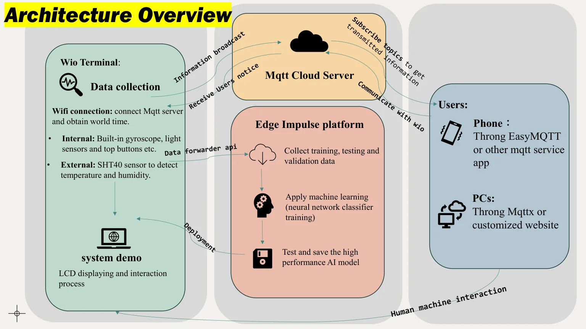
  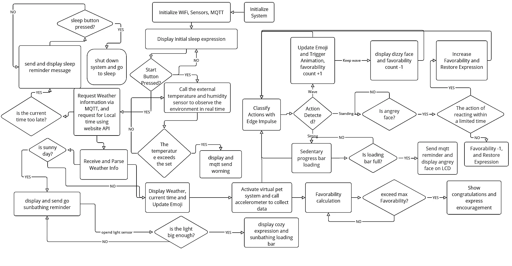
</p>
<p align="center"><sub>Original presentation records: system architecture (slide 4) and program flow (slide 5).</sub></p>

### 1. Startup, clock and weather handshake

On power-up, DeskPal initializes the LCD, SHT40 sensor, accelerometer, Wi-Fi, MQTT client and NTP client. The initial screen shows a sleeping face while the device displays local time and environmental readings. The firmware uses UTC+8 and refreshes the displayed time on a nominal two-second schedule.

Pressing the rightmost **A button** starts the interaction. DeskPal publishes `request_weather` to `weather/request` and waits for this JSON on `weather/response`:

```json
{
  "city": "Ningbo",
  "weather": "cloudy"
}
```

After parsing `city` and `weather`, the device displays them and changes to its normal smiling state. Weather is supplied by the phone or computer MQTT client; the recovered firmware does not call an external weather API.

<p align="center">
  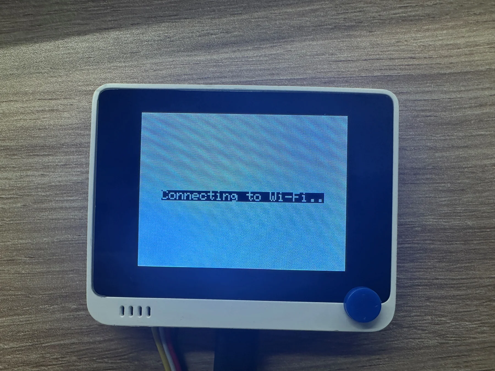
  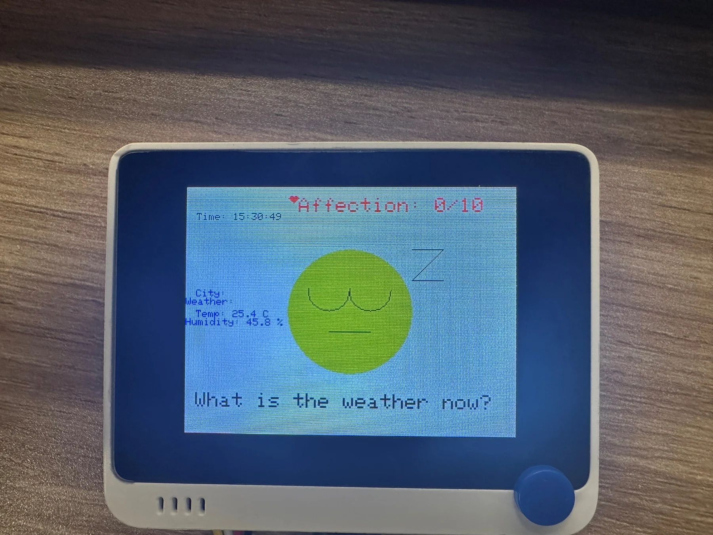
  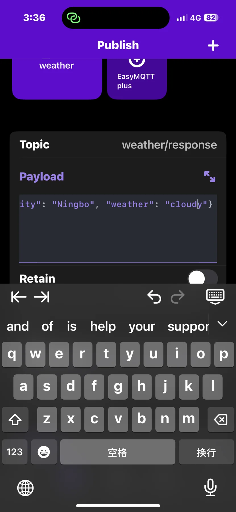
</p>
<p align="center"><sub>Slide 11: Wi-Fi startup, on-device weather request and phone MQTT response.</sub></p>

### 2. On-device motion classification

DeskPal samples the Wio Terminal's three-axis LIS3DHTR accelerometer and runs the recovered Edge Impulse model locally. Its labels are `idle`, `rise` and `wave`. The LCD prints all three probabilities at the bottom of the screen.

The presentation records an MLP with a **78-feature input**, fully connected layers of **30, 10 and 3 outputs**, learning rate **0.01**, **200 epochs** and batch size **32**. The recovered export confirms the 78-feature input and three output classes, but the raw training recordings and training run are unavailable. The settings are preserved as historical presentation records rather than reproduced results.

The presentation explains 0.6 as a general recognition threshold. The application logic actually requires a probability above **0.8** for `rise` and `wave` interactions. The generated Edge Impulse metadata separately contains a 0.6 model threshold.

<p align="center">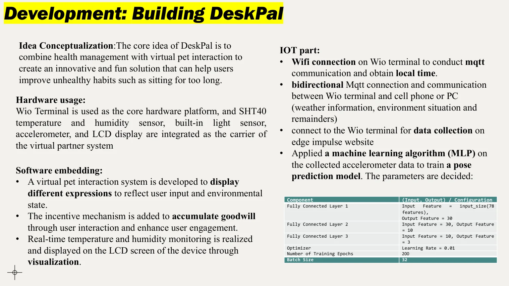</p>
<p align="center"><sub>Slide 6: recovered presentation record of hardware, embedded software, IoT links and MLP settings.</sub></p>

### 3. LCD virtual-pet interface

The 320 × 240 display shows local time, city, weather, temperature, humidity, the affection score, state-specific faces, all three motion probabilities and a vertical progress bar for inactivity or sunbathing. The recovered faces cover sleeping, smiling, sad, dizzy, sunbathing/cozy, hot-warning and bedtime-reminder states. Expression names are also published on `facial`, allowing a remote client to mirror the device state.

<p align="center">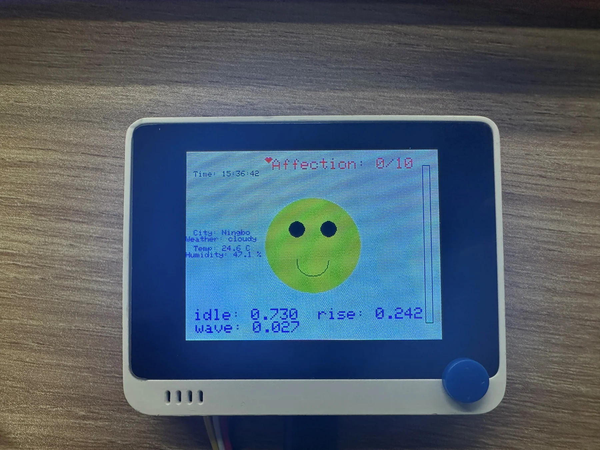</p>
<p align="center"><sub>Slide 11: main interface after weather data is received.</sub></p>

### 4. Inactivity and stand-up interaction

When the inactivity counter reaches **20 classifier-loop outcomes**, DeskPal displays a sleeping/unhappy face with a red exclamation mark and publishes `You need to stand up!` on `reminders`. If a confident `rise` is then detected, the device returns to a smile, clears the bar and adds one affection point.

If the reminder remains unresolved, DeskPal changes to a sad face, publishes `Don't be lazy! You need to stand up!` and removes one affection point. The counter is an interaction counter, not measured sedentary minutes; blocking inference and network work affect its real elapsed time.

<p align="center">
  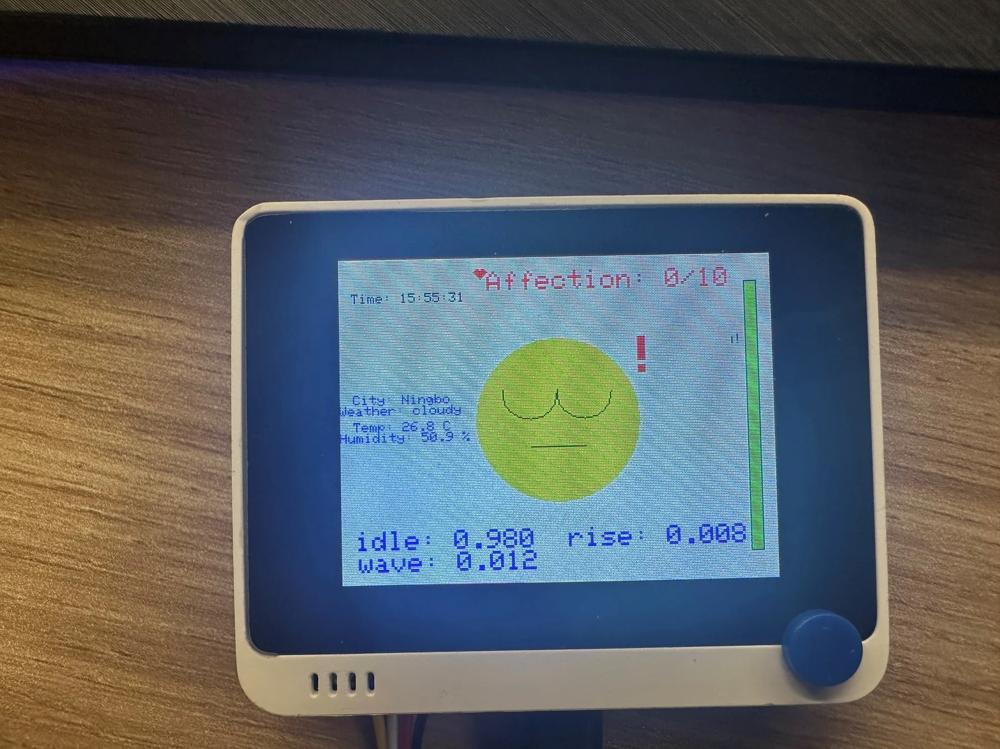
  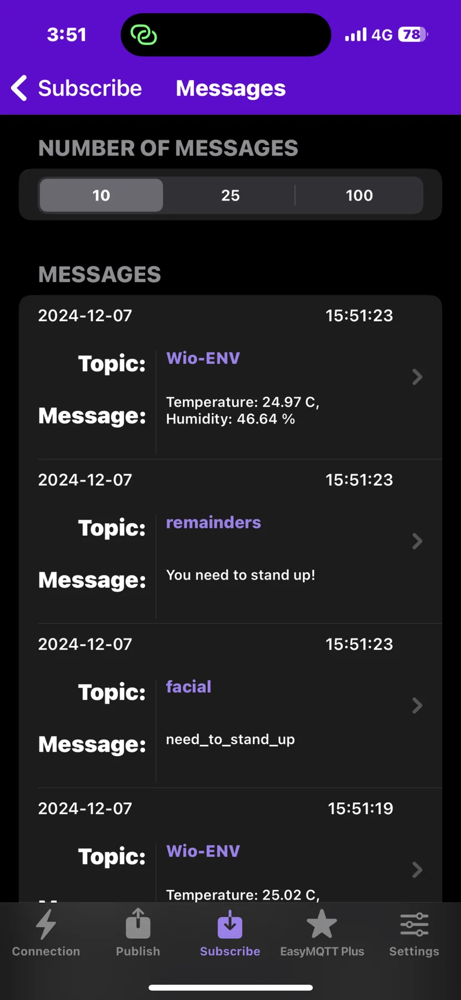
</p>
<p align="center"><sub>Slide 12: full inactivity bar and the corresponding phone reminder.</sub></p>

### 5. Wave, funny and dizzy states

A confident `wave` result enters the shake interaction. Two wave detections inside the five-second window display `That's funny!` and add one affection point. A third continued wave changes the face to dizzy, removes one affection point and resets the wave counter. The presentation describes a phone alert for this interaction, but the recovered wave branch does not publish a dedicated dizzy notification; the facial state can still be published by its drawing routine.

<p align="center">
  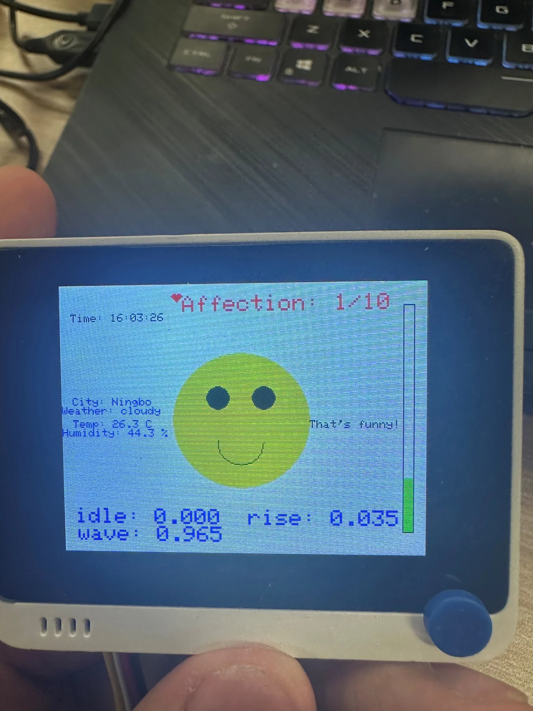
  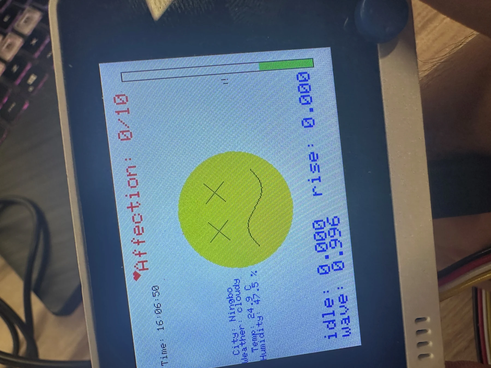
  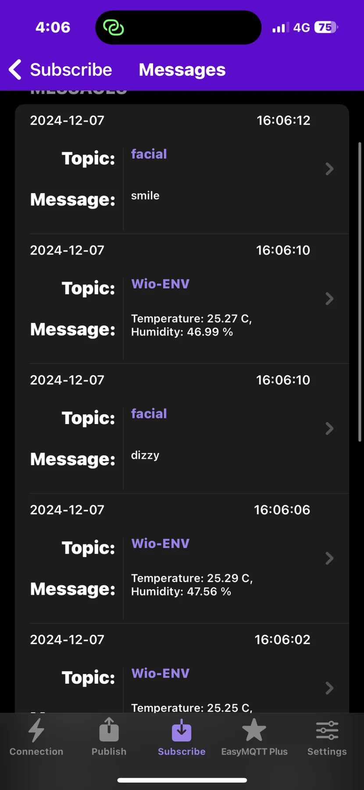
</p>
<p align="center"><sub>Slide 13: funny response, dizzy state and phone MQTT record.</sub></p>

### 6. Affection and daily-completion reward

Positive interactions increase the heart-based affection score and negative interactions reduce it. The maximum is **10**. Reaching 10 temporarily replaces the normal interface with `You've completed all achievements today! You must have had a good day!`, then returns to the smiling face. The middle **B button** is retained as a test shortcut that increments affection; it is a development aid rather than a normal reward path.

<p align="center">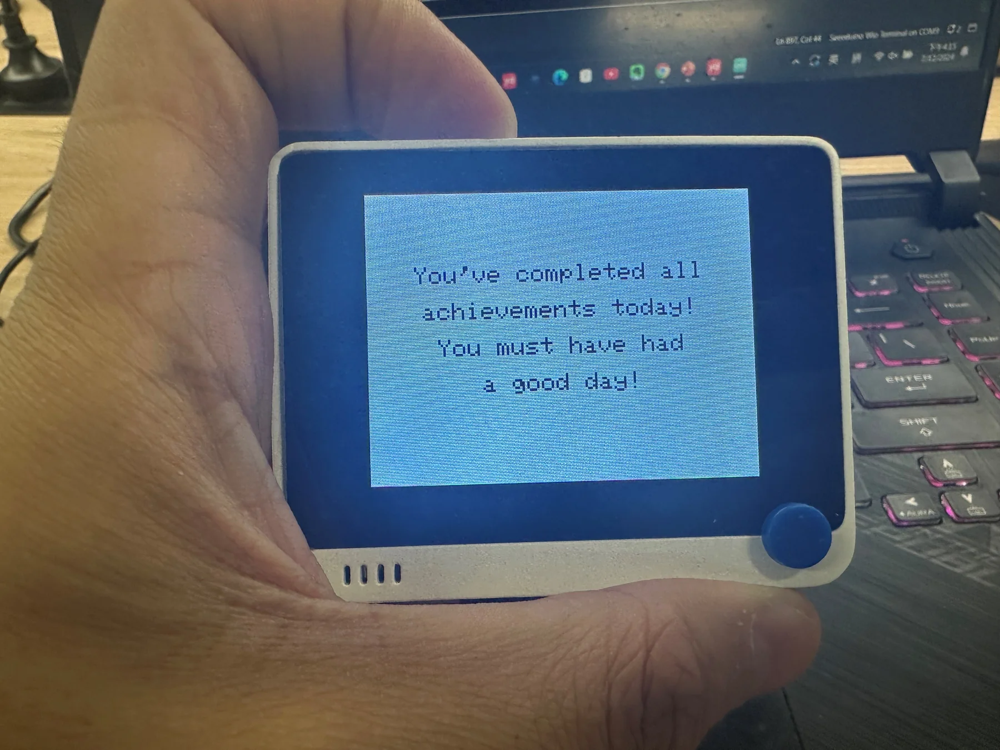</p>
<p align="center"><sub>Slide 13: completion message at the 10-point affection limit.</sub></p>

### 7. Sunny-weather and light interaction

When the exact weather string is `sunny`, DeskPal publishes `Let's go sunbathing!`, displays a reminder and enables the onboard light-sensor interaction. Light readings above **500** start a nominal **30-second** sunbath. The pet wears sunglasses/cozy expression, motion classification pauses and the right-hand bar shows progress. Completing the interval adds one affection point and displays `good job!`; removing the light early cancels the interaction.

The presentation demonstrates this with a tablet flashlight. The commented source records a one-minute design value, while the submitted demo uses 30 seconds.

<p align="center">
  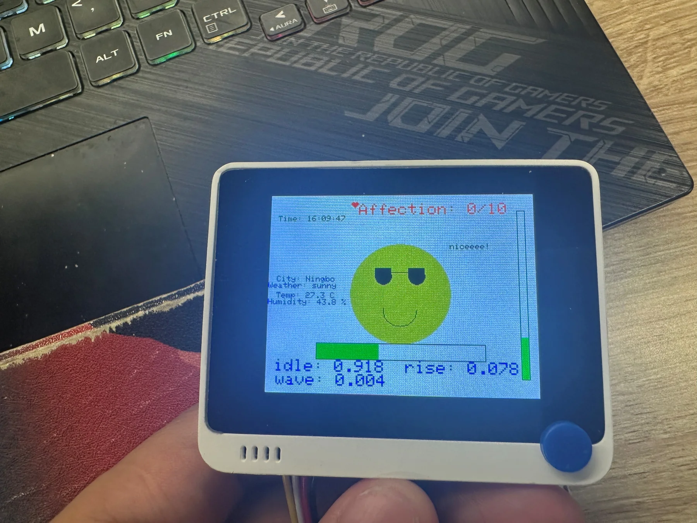
  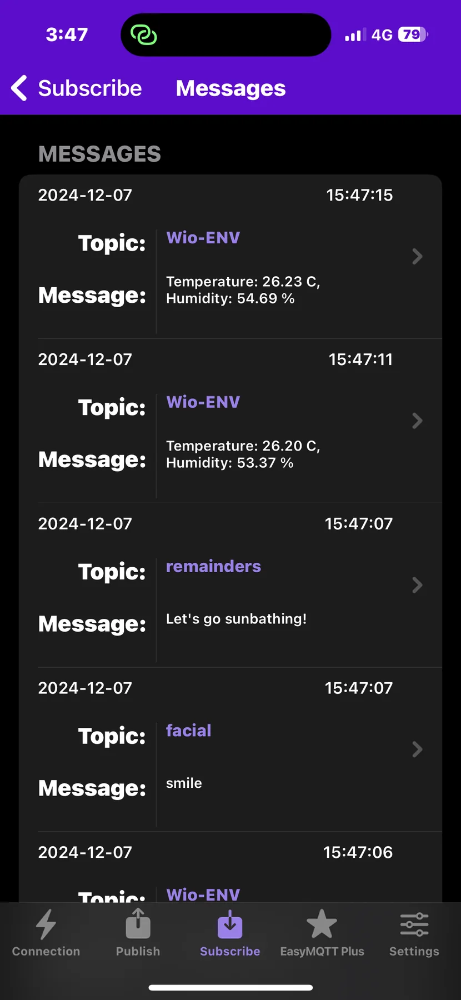
</p>
<p align="center"><sub>Slide 14: sunglasses/light state and its MQTT reminder.</sub></p>

### 8. Temperature and humidity monitoring

The external SHT40 is sampled on a nominal three-second schedule. DeskPal displays temperature and relative humidity locally and publishes a human-readable reading to `Wio-ENV`.

Above **30 °C**, the prototype displays a hot warning and publishes `Warning: Temperature above 30°C, too hot!`. The presentation says 30 °C was deliberately chosen to make the classroom demo obvious and suggests that a real deployment would require a different, validated alarm threshold. This is a prototype reminder, not a calibrated heat or fire alarm.

<p align="center">
  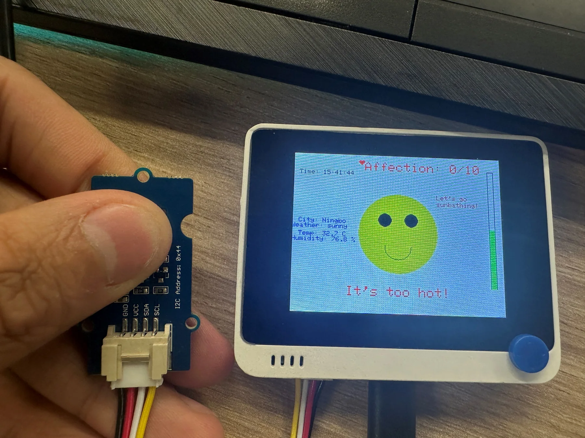
  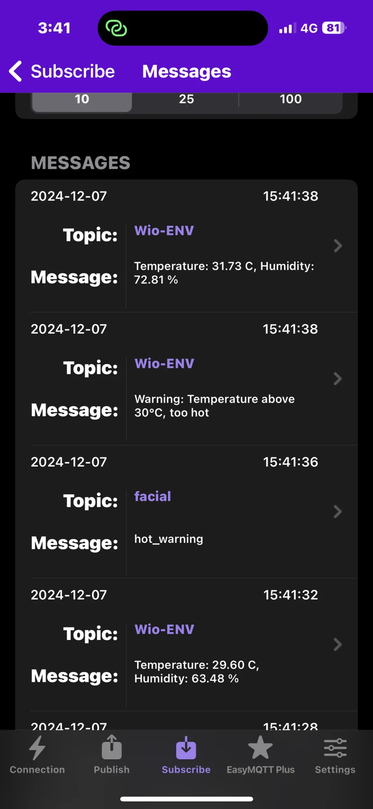
</p>
<p align="center"><sub>Slide 14: SHT40 demonstration and phone temperature warning.</sub></p>

### 9. Sleep-management interaction

DeskPal reads NTP time and can display a bedtime reminder. Pressing the leftmost **C button** acknowledges it, stops classification, publishes `System shut down, going to sleep.` and returns the pet to its sleeping face.

The presentation says the demo threshold was 4 pm. The submitted source instead checks `currentHour >= 23 || currentHour <= 20` and publishes a message containing `16 PM`; this inconsistent demo logic is preserved and documented rather than silently rewritten.

<p align="center">
  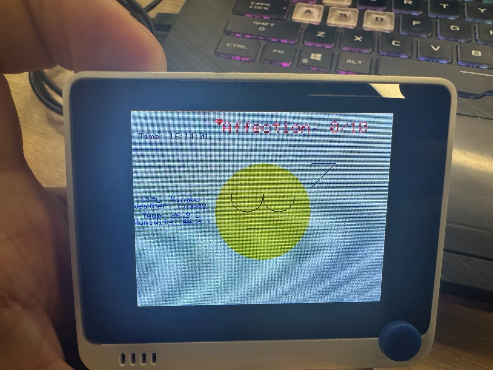
  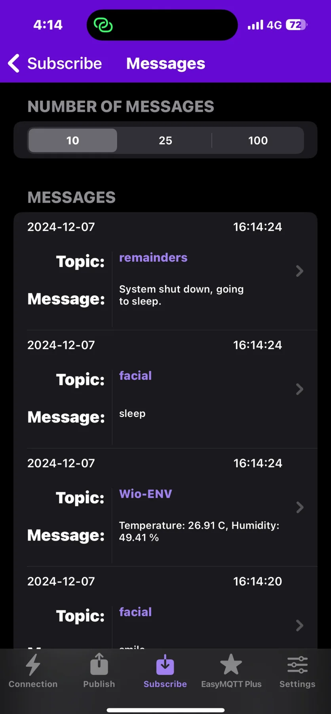
</p>
<p align="center"><sub>Slide 15: sleep state and phone MQTT record after confirmation.</sub></p>

### 10. MQTT topics and remote client

| Topic | Direction | Implemented payload or purpose |
| --- | --- | --- |
| `weather/request` | device → client | `request_weather` after the A button starts the system |
| `weather/response` | client → device | JSON object with string fields `city` and `weather` |
| `Wio-ENV` | device → client | Temperature/humidity text and high-temperature warning |
| `facial` | device → client | Current expression name |
| `reminders` | device → client | Connection, stand-up, sunbath and sleep messages |

The presentation uses EasyMQTT on a phone and MQTTX or a custom website on a computer as example clients. The recovered firmware implements automatic MQTT reconnection and resubscription, but uses unauthenticated MQTT on port 1883.

<p align="center"></p>
<p align="center"><sub>Slide 11: original EasyMQTT subscription feed for environment and reminder topics.</sub></p>

## Presentation-to-repository map

| Slide | Original subject | Repository record | Status |
| --- | --- | --- | --- |
| 1 | Project identity and presentation video | Title, author, 2024 date and award evidence | Preserved; private student number omitted |
| 2 | Feasibility, health motivation and comparable products | Coursework proposals below | Concept and projections, not test results |
| 3 | Subscription, in-app purchase, advertising and ROI | Historical figures below | Coursework business scenario, not realised revenue |
| 4 | Wio Terminal, Edge Impulse, MQTT and client architecture | Firmware, model library and architecture document | Core architecture implemented |
| 5 | Program flowchart | This catalogue and [Architecture](docs/ARCHITECTURE.md) | Implemented with documented caveats |
| 6 | Hardware, UI, IoT and MLP configuration | Firmware, model metadata and training settings above | Hardware/software implemented; training run not reproducible |
| 7 | Development challenges and solutions | Historical engineering notes below | Preserved as development record |
| 8 | Deployment risks and mitigations | Proposed roadmap below | Mostly proposed; MQTT reconnect exists |
| 9 | Updates, maintenance, community and companion app | Proposed roadmap below | Future work, not in recovered firmware |
| 10 | Security threat table | Security gap analysis below | Reconnect exists; TLS, auth, 2FA, signatures and backups are absent |
| 11 | Startup, weather request and MQTT environment feed | Sections 1, 8 and 10 | Implemented |
| 12 | Motion result, inactivity bar and stand-up reward | Sections 2–4 | Implemented; threshold/timing clarified from source |
| 13 | Wave/dizzy interaction and affection goal | Sections 5–6 | Implemented, except no dedicated dizzy alert was found |
| 14 | Sunbathing and high-temperature warning | Sections 7–8 | Implemented as classroom-demo logic |
| 15 | Bedtime reminder and sleep confirmation | Section 9 | Implemented with preserved time-condition inconsistency |

## Development record from the presentation

- **Edge Impulse connection and tooling:** the Wio Terminal could not be used as a direct browser data source, so the project used Edge Impulse firmware, CLI tooling, a serial monitor and the device sensor API to collect accelerometer data.
- **Confusion between rise and wave:** the presentation records iterations to hidden-layer structure, learning rate, epochs, dropout and dataset cleanup guided by cluster plots or a confusion matrix. No raw data or evaluation export was recovered to independently verify the final accuracy.
- **LCD layout and blocking behavior:** early versions suffered overlapping output and apparent stalls. The final sketch separates display regions and schedules sensor reads, clock updates and expression drawing, although several network and inference paths remain blocking.

## Coursework proposals and future work

Slides 2–3 frame DeskPal as a desktop health-IoT and virtual-pet concept. They propose a 10–15% reduction in health complaints, about $200 annual health savings per user, subscriptions, in-app purchases, advertising, $1.8 million annual revenue and 414% ROI. These numbers are coursework assumptions; the recovered materials contain no user study, financial validation or deployed business.

Slides 8–9 propose dust/water-resistant housing, calibration, BLE fallback, low-power operation, battery support, regulatory compliance, distributed MQTT, cloud updates, remote diagnosis, replaceable hardware modules, user feedback, community support, a dedicated companion app, new motion classes and new games. None of those additions is present in this repository unless explicitly listed in the implemented feature catalogue.

Slide 10 proposes MQTT over TLS, SHA-256 integrity checks, broker username/password authentication, 2FA, firewalls, digital signatures and backups. The recovered sketch only contains basic Wi-Fi/MQTT connection and reconnect behavior. Use it on a controlled network and review [Known limitations](docs/KNOWN_LIMITATIONS.md) before extending it.

## Start here

1. Follow [SETUP.md](docs/SETUP.md) to install the Wio Terminal board support and dependencies.
2. Install the included `libraries/PoseDetection_inferencing` Arduino library.
3. Copy `firmware/DeskPal/config.example.h` to `firmware/DeskPal/config.h` and enter your Wi-Fi and trusted LAN MQTT broker details.
4. Open `firmware/DeskPal/DeskPal.ino` in Arduino IDE and select **Seeeduino Wio Terminal**.
5. Build, upload and follow the [hardware demo sequence](docs/DEMO.md).

No hardware build or live device run has been completed as part of this recovery. The original dependency versions were not preserved. See [known limitations](docs/KNOWN_LIMITATIONS.md) before reproducing the demonstration.

## Model recovered with the submission

| Item | Exported value |
| --- | --- |
| Edge Impulse project | PoseDetection |
| Deployment/library version | 13 / 1.0.13 |
| Classes | idle, rise, wave |
| Input | 125 samples × 3 accelerometer axes |
| Sampling interval | 16 ms (62.5 Hz) |
| DSP feature count | 78 |
| Model format | Compiled, quantized int8 inference export |

The model can be inspected in [`libraries/PoseDetection_inferencing`](libraries/PoseDetection_inferencing). Raw training recordings and an independently reproducible training/evaluation pipeline were not found.

## Project layout

```text
firmware/DeskPal/   Original submitted application with externalized configuration
libraries/         Recovered inference export and its upstream license notices
media/             Prototype, reminder-state and award photographs
examples/          Manual MQTT weather payload
scripts/           Repository validation
docs/             Setup, architecture, demo, provenance and limitations
```

## Demonstration and award


The source slide deck, PDF, business-case notes, code ZIP, audio/subtitles and video editor project were recovered into a separate local archive. They are indexed in [MATERIALS.md](docs/MATERIALS.md). The final MP4 and three original MOV clips have **not been recovered**. No fabricated or reconstructed clip is presented as the historical demonstration.

## License

DeskPal application and new documentation: [Apache-2.0](LICENSE). Upstream code retains its own licenses: [third-party notices](THIRD_PARTY_NOTICES.md). Images and historical presentation materials are documentary evidence and are excluded from the root software license; no rights to university or vendor trademarks are granted.
