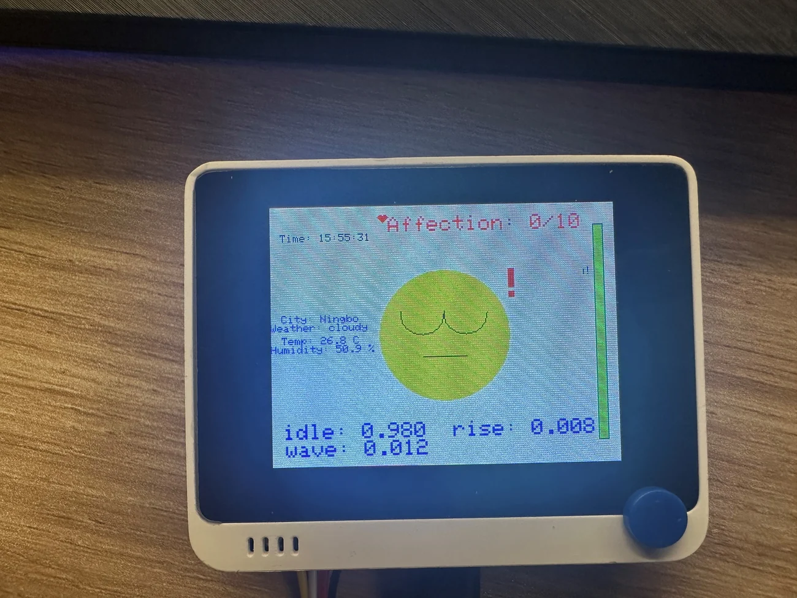
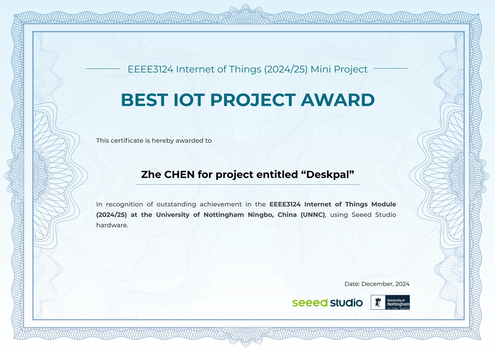

# DeskPal

A Wio Terminal desktop companion that connects motion classification, environmental sensing, an expressive LCD interface and MQTT interaction.

**Best IoT Project Award · EEEE3124 Internet of Things (2024/25) Mini Project · University of Nottingham Ningbo China · December 2024.**

Developed by **Zhe Chen** during the final undergraduate year. This repository preserves the submitted 2024 prototype, with credentials externalized for sharing in 2026.

[中文说明](README.zh-CN.md) · [Setup](docs/SETUP.md) · [Architecture](docs/ARCHITECTURE.md) · [Demo guide](docs/DEMO.md) · [Recovered materials](docs/MATERIALS.md)


## What it does

- Runs the recovered Edge Impulse model locally on three accelerometer axes to classify **idle, rise and wave**.
- Uses a Seeed Wio Terminal LCD to display expressions, class probabilities, an affection score and interaction progress.
- Reads an external **SHT40** temperature/humidity sensor and the onboard light sensor.
- Exchanges environment readings, facial states, reminders and manually supplied weather through MQTT.
- Uses NTP for an on-screen clock with the original UTC+8 configuration.

These are device-motion classes and prototype interaction rules. The repository does not establish human posture accuracy, health benefit, clinical validity, product revenue, or security certification.

## Start here

1. Follow [SETUP.md](docs/SETUP.md) to install the Wio Terminal board support and dependencies.
2. Install the included `libraries/PoseDetection_inferencing` Arduino library.
3. Copy `firmware/DeskPal/config.example.h` to `firmware/DeskPal/config.h` and enter your Wi-Fi and trusted LAN MQTT broker details.
4. Open `firmware/DeskPal/DeskPal.ino` in Arduino IDE and select **Seeeduino Wio Terminal**.
5. Build, upload and follow the [hardware demo sequence](docs/DEMO.md).

No hardware build or live device run has been completed as part of this recovery. The original dependency versions were not preserved. See [known limitations](docs/KNOWN_LIMITATIONS.md) before reproducing the demonstration.

## Model recovered with the submission

| Item | Exported value |
| --- | --- |
| Edge Impulse project | PoseDetection |
| Deployment/library version | 13 / 1.0.13 |
| Classes | idle, rise, wave |
| Input | 125 samples × 3 accelerometer axes |
| Sampling interval | 16 ms (62.5 Hz) |
| DSP feature count | 78 |
| Model format | Compiled, quantized int8 inference export |

The model can be inspected in [`libraries/PoseDetection_inferencing`](libraries/PoseDetection_inferencing). Raw training recordings and an independently reproducible training/evaluation pipeline were not found.

## Project layout

```text
firmware/DeskPal/   Original submitted application with externalized configuration
libraries/         Recovered inference export and its upstream license notices
media/             Prototype, reminder-state and award photographs
examples/          Manual MQTT weather payload
scripts/           Repository validation
docs/             Setup, architecture, demo, provenance and limitations
```

## Demonstration and award





The source slide deck, PDF, business-case notes, code ZIP, audio/subtitles and video editor project were recovered into a separate local archive. They are indexed in [MATERIALS.md](docs/MATERIALS.md). The final MP4 and three original MOV clips have **not been recovered**. No fabricated or reconstructed clip is presented as the historical demonstration.

## License

DeskPal application and new documentation: [Apache-2.0](LICENSE). Upstream code retains its own licenses: [third-party notices](THIRD_PARTY_NOTICES.md). Images and historical presentation materials are documentary evidence and are excluded from the root software license; no rights to university or vendor trademarks are granted.
