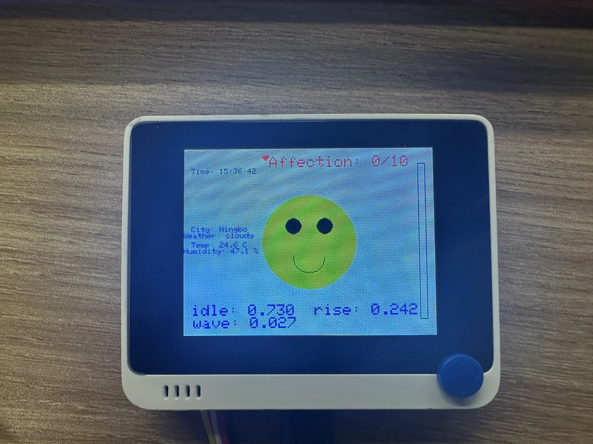

# DeskPal 桌面虚拟伙伴

基于 **Seeed Wio Terminal + Edge Impulse + MQTT** 的本科大四物联网项目，作者 **陈哲 / Zhe Chen**。

获得宁波诺丁汉大学 **EEEE3124 Internet of Things（2024/25）Mini Project 的 Best IoT Project Award**，证书日期为 **2024 年 12 月**。

[English](README.md) · [安装与运行](docs/SETUP.md) · [演示步骤](docs/DEMO.md) · [资料清单](docs/MATERIALS.md)



## 已有功能

设备通过三轴加速度数据进行 `idle / rise / wave` 分类，在 LCD 上显示表情、分类概率、好感度和进度条；通过 SHT40 和板载光传感器感知环境，并用 MQTT 收发环境读数、表情状态、提醒和用户输入的天气。NTP 用于同步时间。

这里的分类对象是**设备运动**。没有恢复出足以证明人体姿态识别准确率、健康改善效果或临床有效性的数据。原课程 PPT 中的商业收入、健康收益、安全设计及未来维护方案不等于固件已经实现的功能。
## PPT 功能完整拆解

下面按原始 15 页 PPT 与固件源码逐项对应。凡是源码中没有实现的内容，均标为课程设计或未来规划。

### 1. 启动、时钟与天气握手

设备启动后初始化 LCD、SHT40 温湿度传感器、LIS3DHTR 三轴加速度计、Wi-Fi、MQTT 和 NTP。初始界面为睡眠表情，同时显示 UTC+8 本地时间与环境数据，时间名义上每 2 秒刷新一次。

按右侧 **A 键**启动交互。DeskPal 向 `weather/request` 发布 `request_weather`，等待手机或电脑向 `weather/response` 发送：

```json
{
  "city": "Ningbo",
  "weather": "cloudy"
}
```

解析 `city` 和 `weather` 后，屏幕显示城市和天气并切换为微笑状态。天气由 MQTT 客户端手动提供；固件没有调用天气 API。

### 2. 端侧动作分类

DeskPal 采集 Wio Terminal 内置 LIS3DHTR 的三轴加速度，在设备本地运行 Edge Impulse 模型，类别顺序为 `idle / rise / wave`。屏幕底部显示三个类别的概率。

PPT 记录的 MLP 结构为：**78 个输入特征 → 30 → 10 → 3 个输出**，学习率 **0.01**，训练 **200 epochs**，批量大小 **32**。恢复出的模型元数据确认 78 特征和 3 个类别，但训练原始数据及完整训练记录未找到，因此这些训练参数属于历史记录，不能视为重新复现实验。

PPT 用 0.6 解释一般识别阈值；实际交互代码对 `rise` 和 `wave` 使用 **0.8**。模型元数据中另有 0.6 阈值，两者含义不同。

### 3. LCD 虚拟宠物界面

320 × 240 屏幕显示时间、城市、天气、温湿度、顶部好感度、底部动作概率，以及右侧久坐或晒太阳进度条。恢复出的表情包括睡眠、微笑、伤心、眩晕、晒太阳/舒适、高温警告和睡觉提醒。表情名称还会发布到 `facial` 主题，远程客户端可同步设备状态。

### 4. 久坐提醒与起身奖励

当久坐计数达到 **20 个分类循环结果**时，DeskPal 显示带红色感叹号的不开心/睡眠表情，并在 `reminders` 发布 `You need to stand up!`。此后若识别到概率大于 0.8 的 `rise`，设备恢复微笑、清空进度条并增加 1 点好感度。

若提醒后仍未解决，设备切换为伤心表情，发布 `Don't be lazy! You need to stand up!`，并减少 1 点好感度。这个计数不是实际久坐分钟数，其真实时间会受到推理和网络阻塞影响。

### 5. 摇晃、好玩与眩晕互动

概率大于 0.8 的 `wave` 会进入摇晃互动。5 秒窗口内第二次识别到 wave 时显示 `That's funny!`，好感度加 1；继续到第三次时切换眩晕表情、好感度减 1，并重置摇晃计数。

PPT 说手机也会收到眩晕提醒，但恢复出的 wave 分支没有专门发布眩晕通知；表情绘制函数仍可通过 `facial` 主题发布状态。README 按源码记录这一差异。

### 6. 好感度与完成奖励

积极互动增加心形好感度，负面互动减少好感度，最大为 **10**。达到 10 时，屏幕显示完成当天成就的鼓励文字，然后返回微笑界面。中间 **B 键**是开发测试快捷键，可直接增加好感度，不属于正常奖励流程。

### 7. 晴天与光照晒太阳互动

当天气字符串严格等于 `sunny` 时，DeskPal 发布 `Let's go sunbathing!` 并进入光照提醒。板载光传感器读数高于 **500** 后开始名义 **30 秒**的晒太阳流程：宠物显示戴墨镜/舒适表情，动作分类暂停，右侧进度条显示进度。完成后好感度加 1，并显示 `good job!`；中途移开光源则取消。

PPT 使用平板闪光灯进行演示。源码注释保留了原先 1 分钟的设计值，提交演示版本实际使用 30 秒。

### 8. 温湿度监测和高温提醒

外接 SHT40 名义上每 3 秒采样一次，LCD 显示温度和相对湿度，同时向 `Wio-ENV` 发布可读文本。

温度高于 **30 °C** 时，屏幕显示高温警告，并发布 `Warning: Temperature above 30°C, too hot!`。PPT 明确说明 30 °C 是为了课堂演示明显而设置，实际应用需要重新验证阈值。因此它不能作为经过校准的中暑或火灾报警器。

### 9. 睡眠管理

DeskPal 读取 NTP 时间，到设定条件后显示睡觉提醒。按左侧 **C 键**确认后，系统停止动作分类，发布 `System shut down, going to sleep.`，并返回睡眠表情。

PPT 说演示阈值设为下午 4 点；提交源码却使用 `currentHour >= 23 || currentHour <= 20`，MQTT 文本又写着 `16 PM`。这是原演示代码中的不一致，本项目如实保留并说明，没有擅自改写历史行为。

### 10. MQTT 完整主题表

| 主题 | 方向 | 已实现内容 |
| --- | --- | --- |
| `weather/request` | 设备 → 客户端 | A 键启动后发布 `request_weather` |
| `weather/response` | 客户端 → 设备 | 含字符串字段 `city` 与 `weather` 的 JSON |
| `Wio-ENV` | 设备 → 客户端 | 温湿度文本和高温警告 |
| `facial` | 设备 → 客户端 | 当前表情名称 |
| `reminders` | 设备 → 客户端 | 连接、起身、晒太阳和睡觉提醒 |

PPT 使用手机 EasyMQTT，以及电脑 MQTTX 或自定义网页作为客户端示例。固件实现了 MQTT 断线重连和重新订阅，但仍是 1883 端口的未认证 MQTT。

## 15 页 PPT 与仓库对应表

| 页码 | PPT 原始内容 | 仓库中的记录 | 状态 |
| --- | --- | --- | --- |
| 1 | 项目身份与演示视频 | 项目名、作者、2024 日期和获奖证据 | 已保留；公开 README 隐去学号 |
| 2 | 可行性、健康动机和竞品 | 下方课程商业设想 | 概念和预测，不是测试结果 |
| 3 | 订阅、内购、广告与 ROI | 下方保留原始数字 | 课程商业情景，不是实际营收 |
| 4 | Wio Terminal、Edge Impulse、MQTT、客户端架构 | 固件、模型库和架构文档 | 核心架构已实现 |
| 5 | 程序流程图 | 本节及 [架构文档](docs/ARCHITECTURE.md) | 已实现，限制另有说明 |
| 6 | 硬件、界面、IoT 和 MLP 参数 | 固件、模型元数据和训练参数 | 软硬件逻辑已实现；训练未复现 |
| 7 | 开发难点及解决方法 | 下方开发过程记录 | 作为历史工程记录保留 |
| 8 | 部署问题及缓解方案 | 下方未来规划 | 多数未实现；MQTT 重连已实现 |
| 9 | 更新、维护、社区和配套 App | 下方未来规划 | 未包含在恢复固件中 |
| 10 | 安全威胁表 | 下方安全差距说明 | 只有重连；TLS、认证、2FA、签名、备份均未实现 |
| 11 | 启动、天气请求与环境 MQTT | 功能 1、8、10 | 已实现 |
| 12 | 动作概率、久坐进度条与起身奖励 | 功能 2–4 | 已实现；阈值和计时按源码澄清 |
| 13 | 摇晃/眩晕与好感度目标 | 功能 5–6 | 已实现，但未找到专门眩晕提醒发布 |
| 14 | 晒太阳与高温提醒 | 功能 7–8 | 作为课堂演示逻辑实现 |
| 15 | 睡觉提醒与按键确认 | 功能 9 | 已实现，但时间条件存在原始不一致 |

## 开发过程记录

- **Edge Impulse 连接和工具链：** Wio Terminal 不能直接作为浏览器数据源，因此安装 Edge Impulse 固件与 CLI，结合串口监视器和设备传感器接口采集加速度数据。
- **rise 与 wave 容易混淆：** 项目尝试调整隐藏层、学习率、训练轮数和 dropout，并依据聚类图或混淆矩阵清理、裁剪或删除误分类数据。由于原始数据和评估导出未找到，最终准确率不能独立复核。
- **LCD 布局和阻塞：** 早期版本存在文字重叠、重复绘制和卡顿。最终代码分区显示并设置传感器、时钟和表情更新时间，但网络重连和部分推理流程仍会阻塞。

## 课程商业、部署与安全设想

PPT 第 2–3 页把 DeskPal 定位为桌面健康 IoT 与虚拟宠物，提出减少 10–15% 健康投诉、每用户每年节省约 200 美元，以及订阅、内购、广告、180 万美元年收入和 414% ROI。这些是课程假设；恢复资料中没有用户研究、财务验证或商业部署证据。

第 8–9 页提出防尘防水外壳、传感器校准、BLE 备用连接、低功耗、外接电池、合规认证、分布式 MQTT、云端更新、远程诊断、模块化更换、用户反馈、社区支持、配套 App、新动作类别和新游戏。除上方明确列为已实现的功能外，这些均属于未来规划。

第 10 页提出 MQTT TLS、SHA-256 完整性校验、MQTT 用户名/密码、2FA、防火墙、数字签名和备份。恢复固件只实现基础 Wi-Fi/MQTT 连接与自动重连。复现时应仅在可信网络使用，并先阅读 [已知限制](docs/KNOWN_LIMITATIONS.md)。

## 使用

1. 阅读 [安装说明](docs/SETUP.md)，配置 Wio Terminal 开发环境及传感器库。
2. 将本仓库的 `libraries/PoseDetection_inferencing` 安装到 Arduino 的 libraries 目录。
3. 将 `firmware/DeskPal/config.example.h` 复制为同目录下的 `config.h`，填写自己的 Wi-Fi 与局域网 MQTT Broker 地址。
4. 打开 `firmware/DeskPal/DeskPal.ino`，选择 Seeeduino Wio Terminal，编译并上传。
5. 按设备右侧 A 键，在 `weather/response` 主题发送 `{"city":"Ningbo","weather":"cloudy"}`，继续 [演示流程](docs/DEMO.md)。

`config.h` 已加入 Git 忽略规则。此次整理保留原始交互逻辑，仅将网络配置外置；未连接实物测试，也没有宣称恢复了原始编译环境。详见 [已知限制](docs/KNOWN_LIMITATIONS.md)。

## 恢复的材料

代码及模型库、15 页最终 PPT 与 PDF、商业分析笔记 DOCX、原始代码 ZIP、获奖证书、项目图片、MP3/SRT 和剪映工程已归档。完整清单见 [MATERIALS.md](docs/MATERIALS.md)。

**最终 MP4 和三段 MOV 仍未找到。** 原素材路径是 `D:\BaiduNetdiskDownload\iot\`。旧 SharePoint 链接于 2026-09-21 检查时返回 HTTP 404，不能据此判断文件永久删除。剪映工程及恢复线索保留在本地归档中。

原始课件包含学号、私人分享链接和第三方素材，因此与公开代码分开存放；本地归档入口为项目总目录的 `START_HERE.md`。

## 授权

应用代码及新整理说明采用 Apache-2.0。第三方模型运行库保留原许可证。项目照片、证书、学校及厂商标识、历史演示资料不纳入根目录软件许可证。原始文件未被修改。
