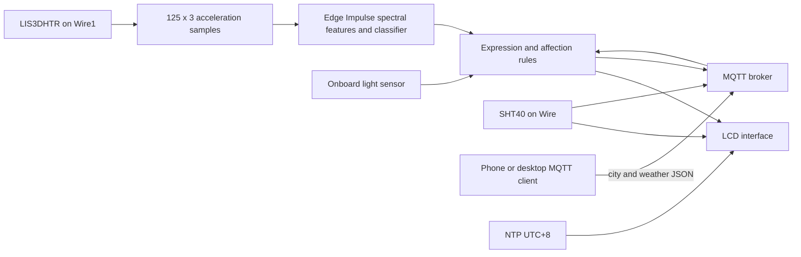

# Architecture and original behavior

The three model labels are `idle`, `rise`, `wave` in that exact order. The main application directly indexes classification outputs and uses a confidence threshold of **0.8** for rise/wave decisions. The generated model metadata contains a threshold of **0.6**; do not confuse that with the application's interaction threshold.

The exported window is 125 samples at 62.5 Hz, approximately 2 seconds. The sketch has an additional 2-second pre-sampling delay and a 3500 ms loop deadline, but the 375-float buffer caps acquisition at 125 three-axis samples. It clamps acceleration to ±2 g then converts to m/s². This timing has not been remeasured on hardware.

## MQTT contract

| Topic | Direction | Payload |
| --- | --- | --- |
| `weather/request` | device → client | `request_weather` |
| `weather/response` | client → device | JSON with `city` and `weather` |
| `Wio-ENV` | device → client | Human-readable temperature/humidity text or high-temperature warning |
| `facial` | device → client | Expression name string |
| `reminders` | device → client | Human-readable reminder/status text |

Weather response is accepted only while `waitingForWeatherResponse` is true. The exact lowercase string `sunny` enables the light-dependent sunbath path. Other strings do not trigger that path. Weather is manually provided; no weather API implementation was recovered.

## Rules visible in source

- Non-rise iterations increment an inactivity counter; confident wave detection can increment it again. Therefore it is neither an exact timer nor a pure count of predicted idle labels.
- The counter threshold is 20; confident rise resets it and may reward completion of a reminder.
- The sunny/light interaction uses a light threshold of 500 and a nominal 30-second exposure interval.
- Temperature/humidity is scheduled nominally every 3 seconds, but blocking network and inference work can delay it.
- Affection caps at 10; the original cap latch is not reset after later decreases.

The 2024 code is preserved for traceability. See [known limitations](KNOWN_LIMITATIONS.md).
